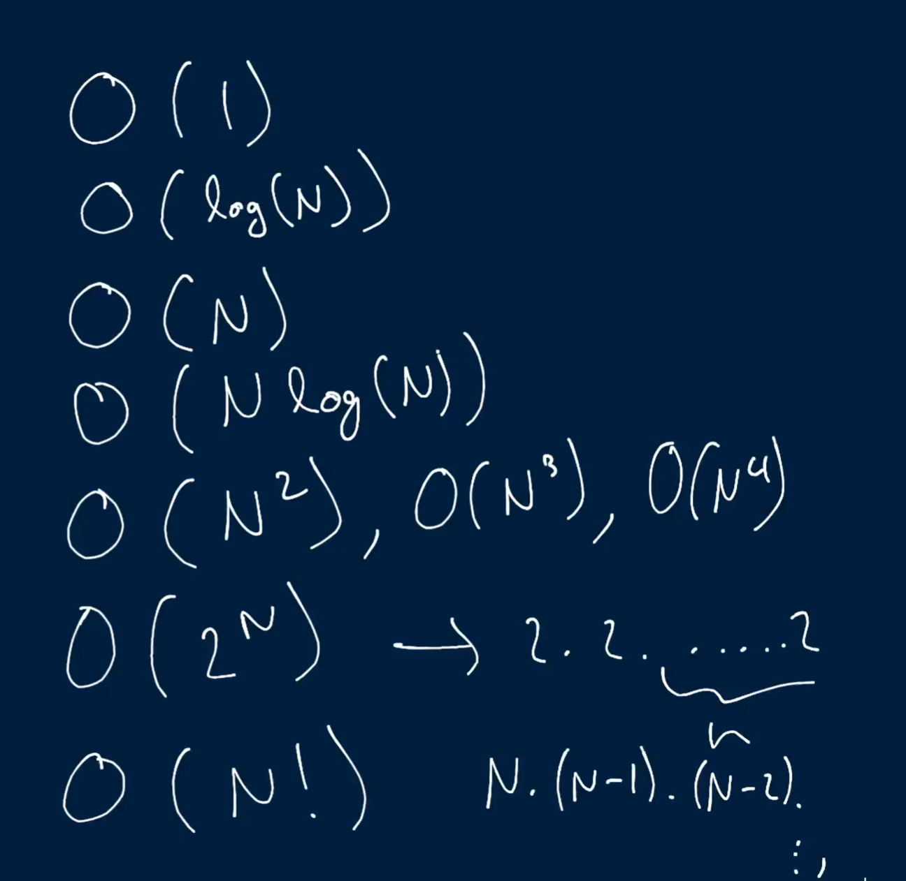

## Big O Notation?

Why cant we use seconds to describe time and space complexity?

What is time complexity?
What is space Complexity?

## What is Asymptotic analysis:
Analyzing the behavior of a function given an input n when N tends towards input.
This is the measurement of the time or space complexity (change in speed) of an  algorithm as the input changes and tends towards infinity.  

With this analysis, we only ever care about functions that change with input. So no matter the size of activity being performed if it takes the same time or memory size every time it is considered an constant.

## What is Big o complexity
This is an asymptomatic analysis. It is a notation used to that tells us the worst case complexity of an algorithm. 

o(1) => Constant time
o(log(n)) => Logarithmic time
o(N) => Linear Time
o(NLog(N)) => Log-Linear time
o(N^2) => Quadratic
o(N^2) => Cubic
o(2^N) => Exponential
o(N!) => Factorial

CheatSheet: [Cheat Sheet](https://www.freecodecamp.org/news/big-o-cheat-sheet-time-complexity-chart/)