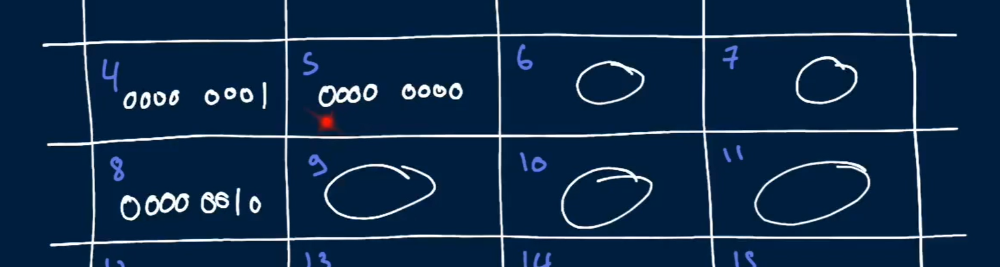

Memory

We declare and use variables in our code. behind the scene the variable has to be stored so we can use it later.

What is memory?
Imagine a canvas that is bounded and divided into a bunch of little slots
Note that the number of slots are finite meaning they can finish
We can call the slots memory slots
"Bounded" means there is a finite amount of memory.

If a program needs to store stuff in multiple memory slots then it will store it in back-to-back memory slots.

Memory is made up of bits (0s and 1s).
It is stored in blocks of 8 bits called bytes eg (0000 0001).
Then the bytes are stored in the memory slots.

But note that the data values that can be represented by tis is 256. This is because 8 bit => 0000 0001. Each value can either be 0 or 1. so for all eight bits we have 2 variations x 2 variations x 2 variations x 2 variations x 2 variations x 2 variations x 2 variations x 2 variations.

Which is equivalent to 2 ^ 8 possible combinations == 256 data values can be potentially represented by 1 byte

**Question:** 
What then happens if we want to store some larger than 256 like a number that is maybe a 32 bit integer. 
**Answer**
Then we would have to store them in multiple memory slots. In the case of 32 bits it would be 32 bits /8 bits = 4 Bytes

What is Endianness

N.b; We are dealing with fixed-width integers. THIS implies that whatever integer type we wor with will always take a constant memory slot. So 62-bit integer will take up the same 
amount of memory slots no matter what.

lists are stored in the same way for example if I am storing two 32 bits integer each take sups 4 memory slots so we need 8 memory slots placed back to back

## How do we store strings.?
We map characters to a number - think ASCII.
For eg Ascii code of A is 65.
Question so how does we know when to use A and when to use 65 as a number?

## Pointers
We can also store the memory address  of another memory slots. This is a pointer from one memory slot to another. Unlike storing stuff back to back, pointers can link to data that is far away.

Nb: the computer can access all the memory slots really quickly.