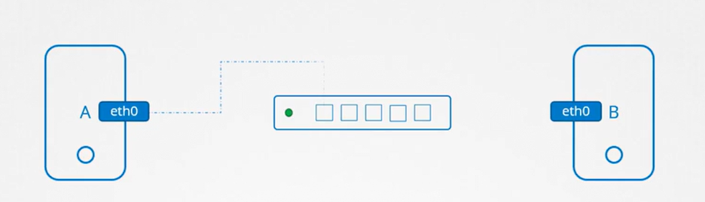
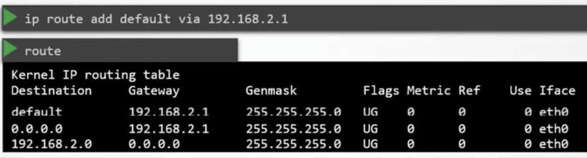
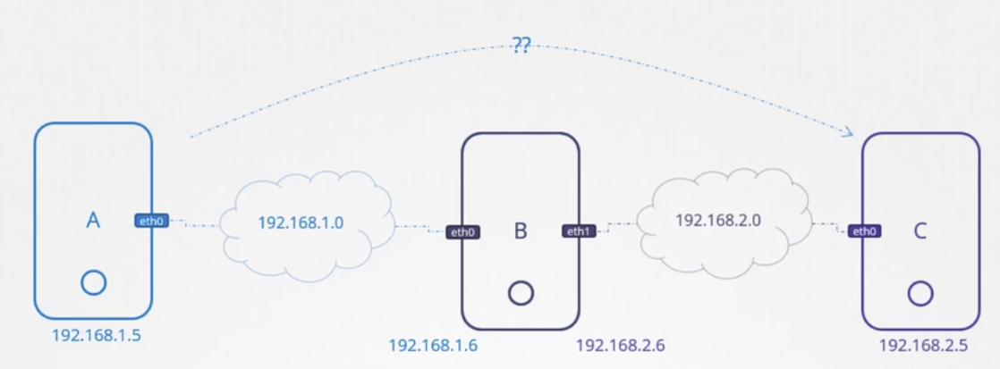

## Basic Networking

What is a Network?
How do computers communicate?
We use a switch. Each host (computer) will have an interface to connect to the switch:
 

To see the interfaces for a host we use the command:
```bash
ip link
```

 Assuming the IP address of the computers are `192.168.1.10` and `192.168.1.11`. We will have to add both systems to the network.:
```bash
ip add 192.168.1.10/24 dev eth
ip add 192.168.1.11/24 dev eth
```
After this the computers can communicate via the switch
Q: How??

Note the switch can only enable communication in this network. 
How does a system in one network communicate with a system in another network?
Thats where a router comes in.

A router is an intelligent device that can enable communication between networks. We assign each of the networks an IP on the router.

For example:
Network 1 -> has (A)`192.168.1.10` and (B)`192.168.1.11`.

Network 2 -> has (A)`192.168.2.10` and (B)`192.168.2.11`.

On the router they will be assigned -> `192.168.1.1` and `192.168.2.1`

At this point we have connected both networks.
The next question now is in a situation where we have multiple routers or connections, how does a network know where to send what to?
Introducing gateway. This is a door to the outside world, routers or the internet.

On each of the system in the we need to configure the routing table. For example for Network 1, we can connect to network 2 by specifying that we want to connect via the gateway on the assigned port of network 1:
```bash
ip route add 192.168.2.0/24 via 192.168.1.1
```

What is we want to connect to the internet. Remember that the internet is also a network, so we would need to specify a new Ip on the router the same way we connected the networks. This will mean configuring all the systems in the networks or more accurately updating the routing table for every system in the network to point to which system they should talk to for what.

A smarter way to go about this is to have a comprehensive routing table on the router it self. Every other computer in the networks is then configured to route any request to an unknown or external IP to that router. So once the router gets the request it can route appropriately based on its table. This will save us a lot of configuration. 
To set a default for any of the computers on the second network, we assign it the ip address on the router:
```bash
ip route add default 192.168.2.1
ip route add 192.168.2.0/24 via 192.168.2.2
```
192.168.2.1 and 192.168.2.2 represent two separate routers



Q: What if the router that is set to have all the configuration then dies, this can render the system useless. Can this happen and if yes, how can it be mitigated. and if no, why?

Please note that in the situation where you have different routers maybe one for all external (internet) connections and another for other local networks. You will need to configure both for example;
 ```bash
ip route add default 192.168.2.1
```


In this sample, A is connected to `192.168.1.0` on IP `192.168.1.5` and C is connected to `192.168.2.0` on IP `192.168.2.5` and B is in the middle and is connected to both `192.168.1.0` and `192.168.2.0` on IP `192.168.1.6` and IP `192.168.2.6` respectively.

For A to connect or communicate with C, we will need to specify that it can do that via B by adding a route:

```bash
ip route add 192.168.2.0/24 via 192.168.1.6
```

Unfortunately, doing this only allows A to be able to see C. To also allow C to be able to see A we also need to do this:
```bash
ip route add 192.168.1.0/24 via 192.168.2.6
```

Because B is connected to two switches, it means it needs two interfaces -> `eth0` and `eth1`. In linux, by default a package we receive from an interface will not be sent through another interface.

For example:
- A said to C using `eth0` -> Hello, please give me a html page
- C gets the message and sends it back via `eth1`
- A will never receive the message

This is a security feature, incase the two interfaces are connected to private networks we do not want to risk information leak. But if we actually want the packages to be moved from point to point, we can always change it.

To do this, we will check the ip_forward file:
`cat /proc/sys/net/ipv4/ip_forward`
This is `0` by default meaning no forward. Change it to 1 to allow communication across interfaces:
`echo 1 > /proc/sys/net/ipv4/ip_forward` 

Please note that by default, this will not be persisted across system reboots. To make it more permanent, you must modify it in the `/etc/sysctl.conf`:
`net.ipv4.ip_forward = 1`

Key Commands:
Note the changes made by performing these commands are persisted only until there is a restart of the system and if you want them more permanent teh it should be done via etc network interfaces file
`ip link`: to list and modify interfaces on the host
`ip addr`: See Ip address assigned to the interfaces
`ip addr add 192.168.1.10/24 dev eth0` : Set Ip address on the interfaces
`ip route`: View routing table
`ip route add 192.168.1.0/24 via 192.168.2.1` //Add entry to the routing table
`cat /proc/sys/net/ipv4/ip_forward` //Check if Ip forwarding is allowed on a host


Q: 
- Does the request first go to B? what is the actual flow and how does it work? 
- What does etc stand for and why is it used every where to start folders

