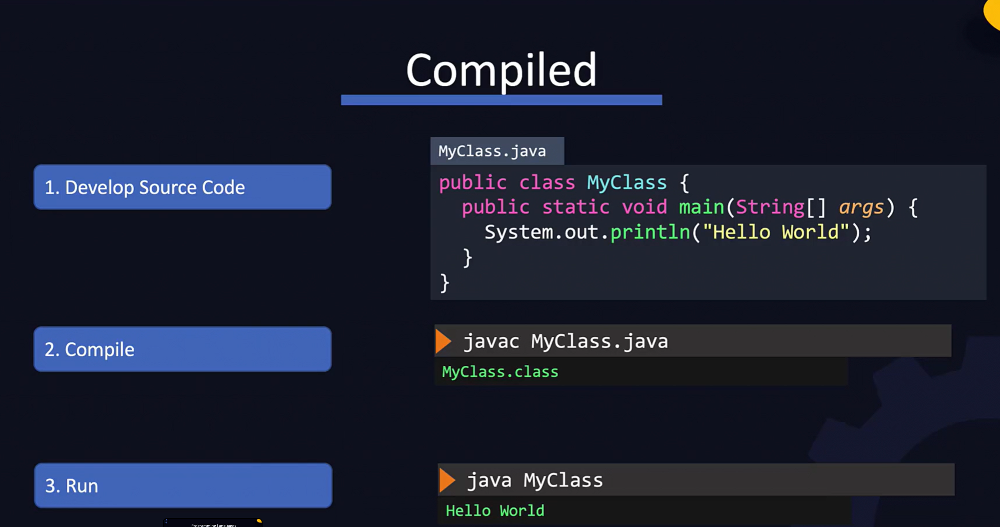
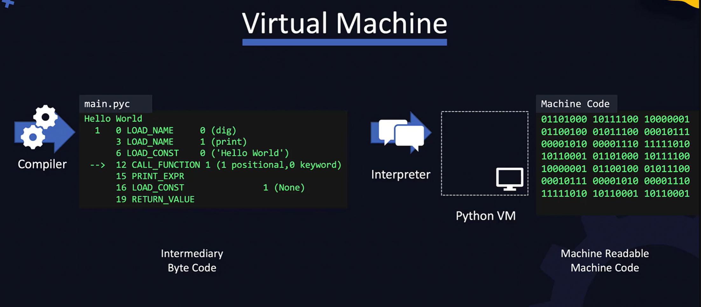

A devops engineer should be comfortable with the basic of development in differnt languages and environments. So that when you are given an application to deploy, you understand how to go aboout it.

We have compiled and interpreted programming languages

What is a compiled language?
These are first developed compiled and
 then executed. It only works on the platform it was deigned for. Eg is Java

What is an interpreted language?
Here we develop the source code and then we run it using an interpreter and example is python.
This is not mean that it is not comppiled at all. Usually when you run the code, it is implicityly compiled into a bytecode and run.

## What is ByteCode?
A compiler translates code from a source code to another language.
In this example it is converted from a source code to a machine readable code. 
Previously, when you compile code, it is compiled into a machine code that can only be run on the same or similar machines rfrom which it was compiled.
Recent compilers now convert the source code into an intermediate code called the bytecode. This bytecode can then be taken by different machines and will be converted by them to the final machine readable machine code and can then be run.

For Python:

We have a .pyc file which is the bytecode. The bytecode is then executed by a pyhtin interpreter in the PythonVM and this is comverted to machine code. All of this happens once you run the pythin command. As long as you have the python VM available on a system, our application can run.

## Packages/Modules/Library
When we build code that can be reused, we share it to the community as a packages. This can also be called a module or a library depending on the programming language.
Usually applications use these packages. Depending on language we have different package managers npm, pip, nuget etc

## Build

