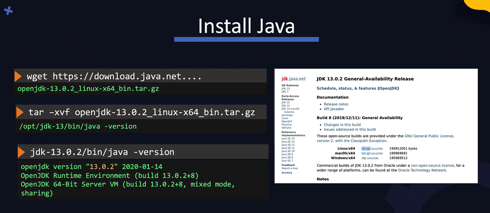
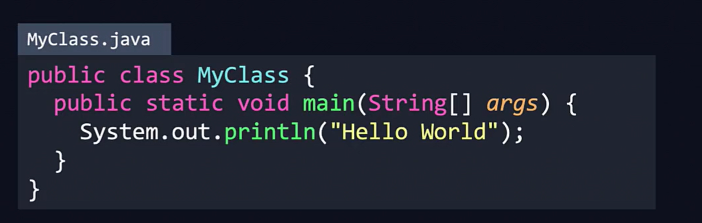
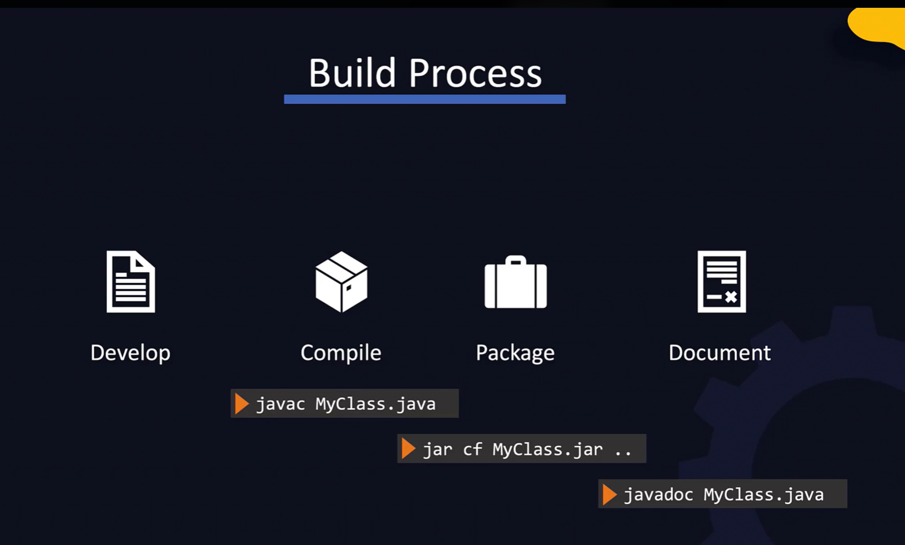
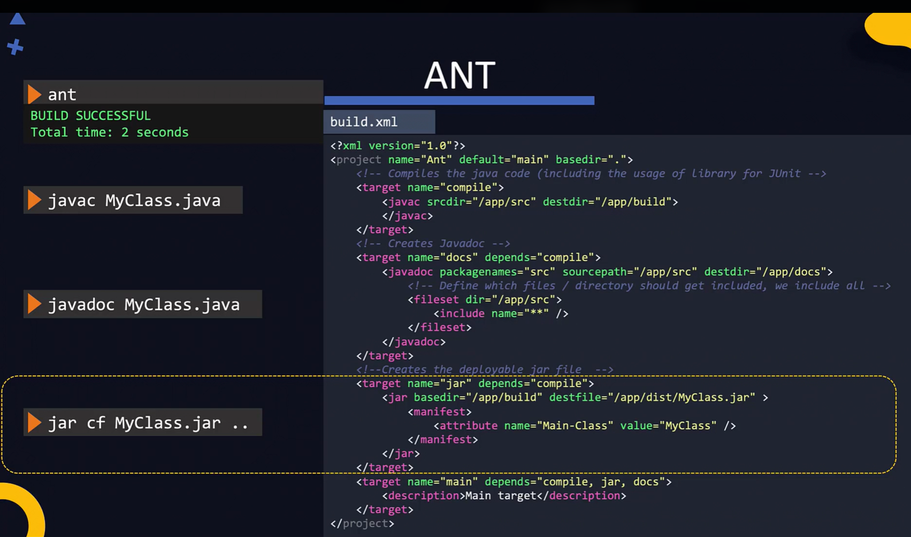

Java is free and OS.

Installing Java:


Step One: Download It into a specified output file
`sudo wget https://download.java.net/java/GA/jdk20/bdc68b4b9cbc4ebcb30745c85038d91d/36/GPL/openjdk-20_linux-x64_bin.tar.gz --output-document /opt/openjdk-20_linux-x64_bin.tar.gz`

or 
   `sudo curl https://download.java.net/java/GA/jdk20/bdc68b4b9cbc4ebcb30745c85038d91d/36/GPL/openjdk-20_linux-x64_bin.tar.gz --output /opt/openjdk-20_linux-x64_bin.tar.gz`

Step Two: Extract File

 `tar -xvf openjdk-20_linux-x64_bin.tar.gz`

 Step Three: Check If It Exists:
 `jdk-20/bin/java -version`

 Step Four: Extract Path:
 The command export `PATH=$PATH:/opt/jdk-20/bin` is used to update the PATH environment variable in a Unix-like operating system. Here's a breakdown of what it does:

- PATH: This is an environment variable that tells the shell where to look for executable files. When you type a command in the terminal, the shell searches through the directories listed in PATH to find the executable file for that command.

- $PATH: This represents the current value of the PATH variable. By using $PATH, you're including all the existing directories already in the PATH.

- /opt/jdk-20/bin: This is the directory where the Java binaries are located. By adding this directory to the PATH, you allow the system to find and execute Java commands without needing to specify the full path to the Java binaries.

- export: This command is used to set the environment variable so that it is available to all child processes of the shell. By exporting PATH, you ensure that the updated PATH is used by any programs or scripts you run from the terminal.

In summary, this command appends the directory /opt/jdk-20/bin to the existing PATH variable, allowing you to run Java commands directly from the terminal without specifying their full path.
To verify that this works, you can run the java command in the terminal. If everything is set up correctly, it should execute without any errors.


Errors Encountered WhilE Installing Java
- I mistakenly copied this `https://download.java.net/java/GA/jdk20/bdc68b4b9cbc4ebcb30745c85038d91d/36/GPL/openjdk-20_linux-x64_bin.tar.gz.sha256` instead of `https://download.java.net/java/GA/jdk20/bdc68b4b9cbc4ebcb30745c85038d91d/36/GPL/openjdk-20_linux-x64_bin.tar.gz`. Then when i tried to extract it, I got an error.
- `curl` used `--output` while `wget` used `--output-document`. The error was:
```
tar: '--same-order' cannot be used with 'unknown?'
Try 'tar --help' or 'tar --usage' for more information.
```

You may see a lot of companies stuck at version 8 becuase version 9 introduced changes that were incompatible with version 8 and many guys could not move.

JDK -> Java development Kit. Which is a set of tools that will help to develop, build and run java applications:

- jdb: debug
- javadoc: document
- javac: builda and compile
- jar: archive the code
- java: run the application
- To run you need JRE (Java Runtime Environment)

## Building A Java Appliction

Say we have a sample code:


We will first compile it using:
`javac MyClass.java`

This will create a new file called `MyClass.class` which is the bytecode

Next we will run the application  suing the JVM using the class name:
`java MyClass`

We can run this byte code on any machine that has JVM

But building a project usually involves multiple class files, so how do we do this?

Welcome Jar . It helps compress and combine multiole class files and their dependencies into a single distributabele package (.jar). If its a web app with images and static content, it will create a .war file which stands for Web Archive.

To create an archive use the jar command and pass in the list of files that need to part of the archive:
`jar cf MyApp.jar <yClass.class Service1.class Service2.class`

Notice the first parameter is the result jar file

When this file is created, it automatically generates a manifest file within the package at path `/META-INF/MANIFEST.MF` This file contains information about the files packaged and anyother info about the application. It also includes the starting point of the app. This is a `Main-Class` property in the manifest file.

This manifest file can be run on any machine that has JVM with the java command. If we decide to run the jar file, we can do it like this:
`java -jar MyApp.jar`
 Its an  HTML version of the code. (Try This)
 ### Documenting Your Code
 `javadoc -d doc MyClass.java`

 -d specifies destination of the documentation the "doc" that follows if path
 

 ### Build Tools
 When the application really complex this build process can get very complex. Sowe use build tools eg maven, ant and Gradle.
 They use configuration file

 Develop -> Compile -> Package -> Document
 this process can get very compilcated when we are workin gwith different devs and sp many source code. build tools can help automate these process.
 They use config files where you ca specify the staps you want to automate and thety execute it accoridgly

 An example is the ANT config which is an XML file:
 

 Notice how every section of this has a specific name and equivalent functionality.

 To run this we use the `ant` command on our CLI. This runs all the processes for us in one swoop
 Incase you want to run very specific actions then you can do this: for example for compile?   


To Install Ant:
sudo yum install -y ant