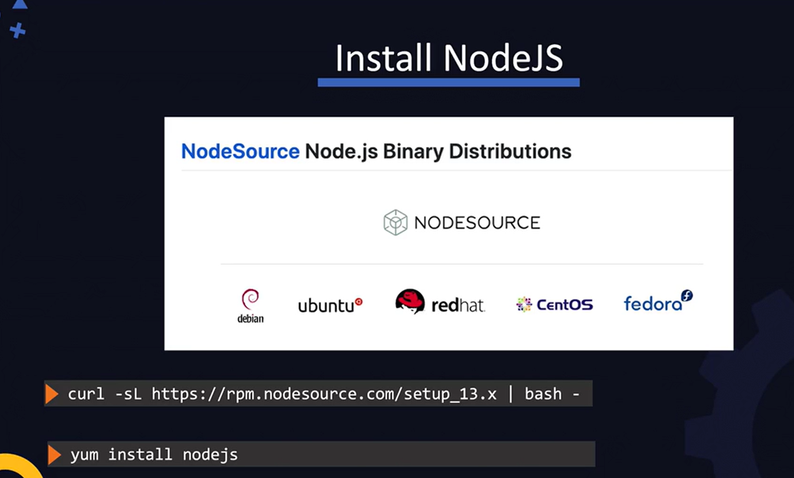
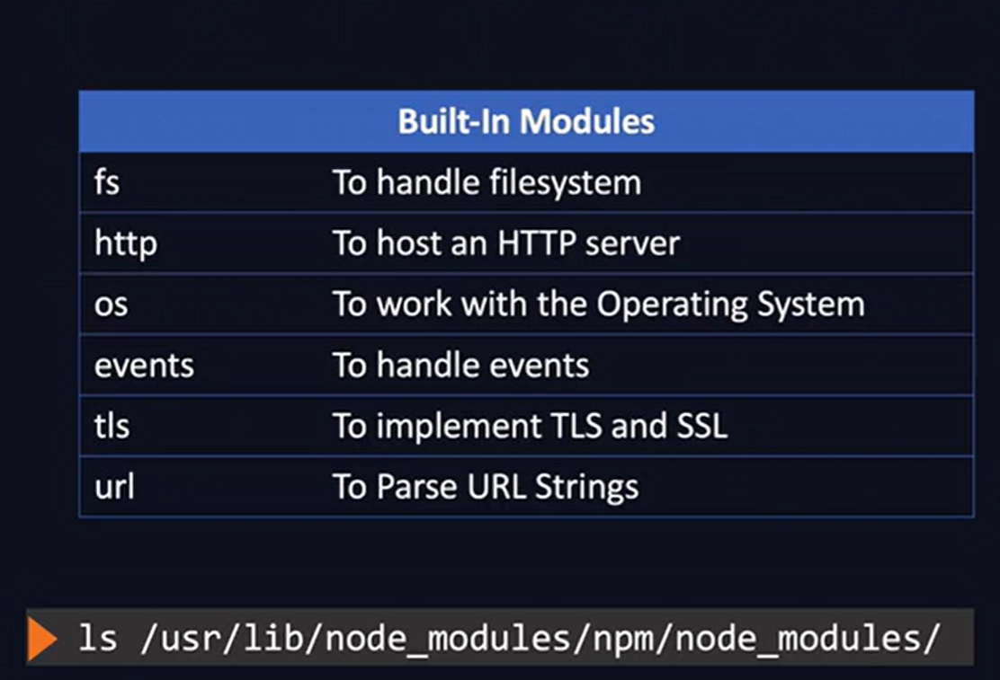
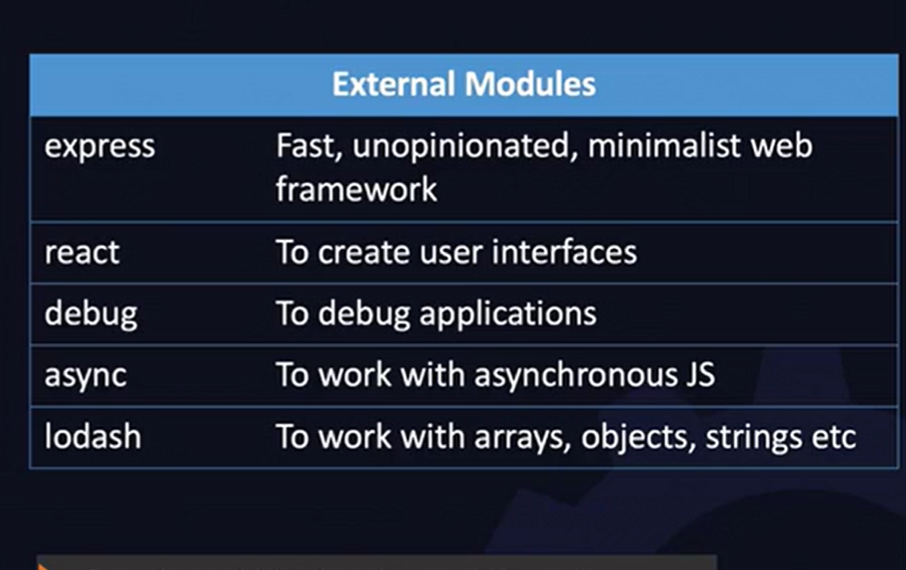

Installing nodejs:

Node Package Manager:
Here is where you can get free usuable packages. 
When you install nodejs, a command line utility called npm is also installed.

npm - v //
npm search file //to search for a package
npm install file //install a package

When you install a package. It is stored in a node_modules folder in the pwd. I that folder, you see a folder with the name of the package you installed. The code for the package will be n the /node_modules/package/lib directory and the /node_modules/package/package.json will contain the metadata for the package. It is a useful file you can inspect to get more information about the package  

There are two ways to install with npm
- globally: npm install -g package
- in the current PWD: npm install -g package

When you "require" a file in a JS file, node will first search for the pacge in the current wotking diretory and if it does not find it then it eill look at other folder.
To see the list of paths that node searches from, run
`node -e "console.log(module.paths)`

Q: What does -e stand for and why did we use ()?

There are two tpes of modules:
Built-In Modules are installed when you install node:

External Modules:
