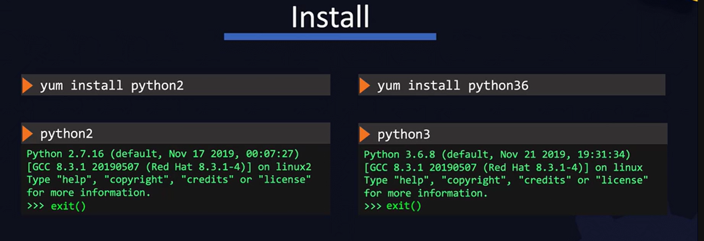

Pyhon is a free software

There are two version

- version 2 - (2000 - 2010)
- version 3 -  (2008 to present)

Python 3 came with considerable changes and it did not come with backward compatibility. Any program done in python 3 will be run with a python 3 interpreter nd any one done in python 2 must be run with a python 2 interpreter.

Python 3 also came with new features that allowed support for ML, AI and Data Analytics


Some OS come with pyton by default to install use:

yum install python36 //v 3.6
yum install python2 //v2

Both can be installed at the same time:


Like the image above, to invoke the interpreter simply type either python2 or  python3. once inside the interpreter, you can type in python commands. To exit() out of it, simply type "exit".

Some versions allow you just type "python" without a version and usually this will default to whatever version was first insatlled.

to get the full version of the installed python, run the Pythin command for the respectvue version: python3 -V

What is the difference between Fedora, CentOs and debian?
I asked this question: why is yum install python38 not working? it says -su: yum command not found
Here is the answer:
It looks like you're trying to use the yum package manager, which is typically used on Red Hat-based systems like CentOS or Fedora. However, the system you're working on seems to be using a Debian-based distribution, such as Ubuntu, which uses apt as its package manager.

To install Python 3.8 on a Debian-based system, you should use the apt command. Here's how you can do it:

Update the package list to ensure you have the latest information about available packages:
   sudo apt update

Install Python 3.8:
   sudo apt install -y python3.8

After running these commands, you can verify the installation by checking the Python version:

python3.8 --version

This should display the version of Python 3.8 that was installed. 

Is apt, yum and npm similar?

KodeKloud AI Assistant
Great question! While apt, yum, and npm are all package managers, they serve different purposes and environments:

apt (Advanced Package Tool):

Used in Debian-based Linux distributions like Ubuntu.
Manages packages written in languages like C, C++, etc.
Installs, updates, and removes software packages from the system repositories.
yum (Yellowdog Updater, Modified):

Used in Red Hat-based Linux distributions like CentOS and Fedora.
Similar to apt, it manages system packages, handling dependencies and updates.
npm (Node Package Manager):

Used for managing JavaScript packages.
Specifically designed for Node.js applications.
Installs, updates, and manages JavaScript libraries and dependencies.
Each of these tools is tailored to manage packages in their respective environments, so while they are similar in function, they are used in different contexts.

Package Manager Python:
pip

we have pip2 and pip3


we can simply use the pip command without specifying the number.
it is important that you check which version of pip you are using so that you dont use pythin to install a packages targeted at python3

Wen we install a package, a folder is created for all the available python versions:


Notice how they are split into 31bit lib and 64bit lib folder.

To see where a package is installed use:
`pip show package-name`

when a package is imported, python looks under a set of directories for the package. So to get a list of paths that python loks for we can run:
`python2 -c "import sys; print(sys.path)"`

These are the default location where you can find stuff

#### Requirements.txt
instead of:
`pip install flask markupsafe gunicorn`

create a file called requirements.txt:
```
flask==0.10.1
markupsafe--0.23
gunicorn==18.0
```
then run:
`pip install -r requirement.txt`

to install an upgrade:
pip install flask --upgrade

to uninstall
pip uninstall flask 

## Other Package Manager:

easy_install was the original way of installung python packages. A set of tools called setup tools are used to package python code into zipped format called eggs. The easy install package manager can then be used to search, find and install those packages.

easy_install install app

We do not need to unpack the egg, we can just download the egg file and place it where Python can find it and it will be used without a need to unpackage it.

The Next One Is Wheels:
The extension is .whl and must be unpacked before installing.


Runing as root user = using sudo
