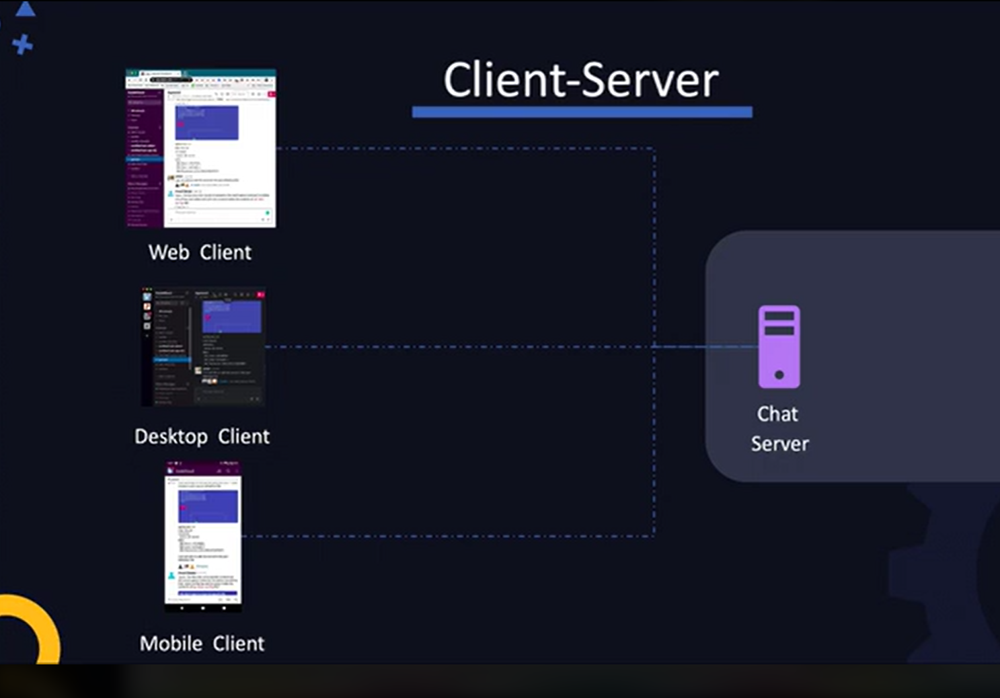
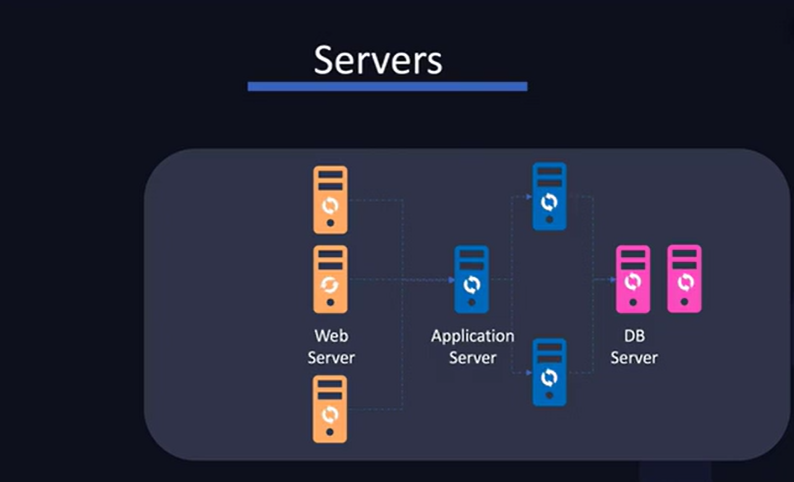

- Standalone vs Client-Server Model
  Eg Calculator vs Slack

In Client-Server system, we can have one server with multiple clients

What is a server: Is a system that has a program that listens for requests on a particular port.

- Web Server: This serves web data like HTML, CSS and JS, Imaes, videos
- Application Server: This runs application logic
- DB Server
- Email Server
- Backup Server

In an exommerce application for example, it is the Application server that handles busimess logic like update the database with order details, shipping products to users etc. The web server component is responsible for serving the nice UI and the images:

### Web Frameworks:

Provide an easy way to create web applications.
After creating the code, we need a way to run it such that the code listens on a port and responds back to the users.
Ngingx, Apache Tomcat, GlassFish, Gubicorn etc are webservers

### Webserver Classification

While both web servers and application servers can host dynamic content, there are important distinctions between the two, even though some web servers can have features that overlap with those of application servers.

Key Differences:
Web Server:

A web server primarily handles HTTP requests and serves static content (such as HTML, CSS, images) to users.

When it comes to dynamic content, a web server forwards requests for dynamic content to an external handler (like a CGI script, PHP, Python, or Java Servlet).

A web server might be configured to handle dynamic content using technologies like PHP, CGI, or FastCGI, but it typically doesn't have full support for managing the application logic itself.

Web servers usually don't provide built-in features for things like transaction management, security, business logic, or other enterprise-level services.

Examples:

Nginx, Apache HTTP Server, LiteSpeed

Application Server:

An application server is designed to provide a complete environment for running dynamic applications. It not only serves web pages but also hosts the application logic.

In addition to serving static content, an application server typically has built-in support for running and managing business logic, such as processing user requests, interacting with databases, managing sessions, and executing the application code.

Application servers usually provide higher-level features like transaction management, security, resource pooling, and messaging.

Examples:

Apache Tomcat (though often considered a web server, it can also act as an application server for Java servlets and JSPs).

WildFly (formerly JBoss), GlassFish (for Java EE applications).

WebLogic and WebSphere (for enterprise-level applications).

When Does a Web Server Act Like an Application Server?
A web server can serve dynamic content, and in some cases, the distinction between a web server and an application server may blur. Some modern web servers come with features like:

Running server-side scripts (e.g., PHP, Node.js).

Interfacing with application logic (e.g., Spring Boot embedded servers like Tomcat or Jetty).

Support for handling sessions, managing requests, and more.

For example:

Node.js: Although not traditionally considered a web server or an application server, Node.js can both handle HTTP requests and manage dynamic content and application logic in a single environment, acting as both.

Tomcat: While it's often classified as a web server, it can also function as an application server for Java web applications because it handles both HTTP requests and application logic (servlets, JSPs).

Summary:
Web Server: Primarily serves static content and forwards requests for dynamic content to external applications or scripts. It may handle dynamic content but typically doesn't manage the application logic directly.

Application Server: Provides a full runtime environment for dynamic web applications, handling both application logic and HTTP requests. It often includes features for transaction management, security, and business logic.

