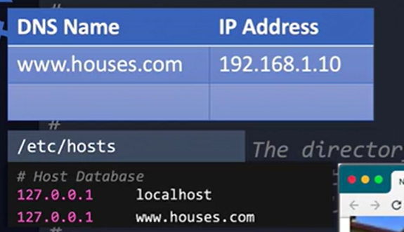

### The Apache Web Server

Used to serve web server. It is used with apache tomcat as the application server

What is HTtpD?
httpd is the Apache HTTP Server, which is one of the most popular web servers in the world. It is used to serve web content over the internet. When you install and start the httpd service, you're essentially setting up a server that can host websites and deliver web pages to users' browsers.

`yum install httpd` install

`service httpd start` start
`sudo systemctl start httpd` start

`sudo systemctl start httpd` and `service httpd start` are used to start the Apache HTTP server, but they are part of different service management systems.

systemctl:
Part of systemd, which is a system and service manager for Linux operating systems. Provides more advanced features and is the default in many modern Linux distributions.
Command: `sudo systemctl start httpd`

service:
Part of the older SysVinit system.
Still available on many systems for backward compatibility.
Command: `sudo service httpd start`
In most modern Linux distributions, systemctl is preferred because it offers more control and is more consistent across different services.

`service httpd status` check status
`firewall-cmd --permannet --add-service=http` if there is a firewall on the system, then add rule to allow HTTP traffic.

Start a service:
Service Version ->`service httpd start` 
SystemCTL Version -> `systemctl start httpd`

Stop a service:
Service Version ->`service httpd stop` 
SystemCTL Version -> `systemctl stop httpd`

Restart a service:
Service Version ->`service httpd restart` 
SystemCTL Version -> 
`systemctl restart httpd`

Check the status of a service:
Service Version ->`service httpd status` 
SystemCTL Version -> `systemctl status httpd`

Enable a service to start on boot:
Service Version ->`chkconfig httpd on` 
SystemCTL Version -> `systemctl enable httpd`

Disable a service from starting on boot:
Service Version ->`chkconfig httpd off` 
SystemCTL Version -> `systemctl disable httpd`

Path to check for logs
`cat /var/log/httpd/access_log`
Path to check for error logs
`cat /var/log/httpd/error_log`

Path to config
`/etc/httpd/conf/httpd.conf`:


Sample Config Content:

```bash
Listen 80
#defines the port

DocumentRoot "/var/www/html"
#defines the location for where the static content is being served from. You can move all your static files there

ServerName www.houses.com:80
#if your host has a DNS name for example codetivite.or, then you may specify it here. This way you can now access your website by going to the URL http://codetivite.org. Remeber that for this to work, you need to point your server or laptop. You must have a DNS entry configured in your network DNS server to point that host to the IP addreess of the your system. Other wise the browser will not know where to look for the internet.
```

A walk around when we want to do this manually is to add this the /etc/hosts file:

```bash
# DNS Name  |   Local Host IP Address
www.codetivite.org 127.0.0.1
```



Any changes requires us to restrt
`service httpd restart` restart

A single apache server can host multiple applications. to do that the files and config of each app is defined as a virtual host within the apache config file.

A virtual host is a logical division of the apache web server. Each virtual host can be configured with its own servername and document root

Sample Config With Virtual Host Content:

```bash
Listen 80
#defines the port

DocumentRoot "/var/www/html"
#defines the location for where the static content is being served from. You can move all your static files there

ServerName www.houses.com:80
#if your host has a DNS name for example codetivite.or, then you may specify it here. This way you can now access your website by going to the URL http://codetivite.org. Remeber that for this to work, you need to point your server or laptop. You must have a DNS entry configured in your network DNS server to point that host to the IP addreess of the your system. Other wise the browser will not know where to look for the internet.

<VirtualHost *:80>
  ServerName www.oranges.com
  DocumentRoot /var/www/oranges
<VirtualHost>

<VirtualHost *:80>
  ServerName www.mangoes.com
  DocumentRoot /var/www/mangoes
<VirtualHost>
#Place the static fiiles for each of the individual apps into the corresponding root
```

### How does this even work??

The Apache web server is a single server running a single web service, listening on the same Ip address and same port.
When a request is typed, for example if www.mangoes.com is typed in the browser the Apache web server will display the files under the mangoes directoty.

so whether you type in oranges.com or mangoes.com, just ensure you have an additonal entry for ornages.com or mangoes.com also pointing to the same IP address of your localhost. Or to test it in a local environment, just add two entries for both of these pointing `127.0.0.1 `

This config file can become a very large file. So we can have individual config files for each of the virtual hosts and then we use an include statement in the main config file like this:

```bash
Include conf/houses.conf
Include conf/oranges.conf
```
