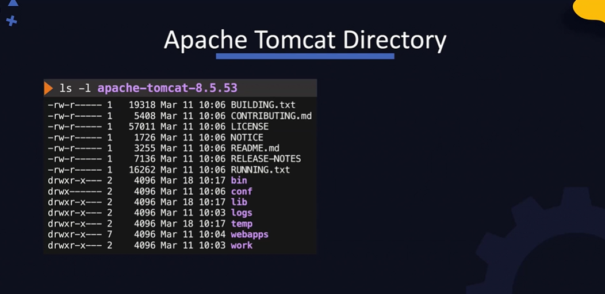
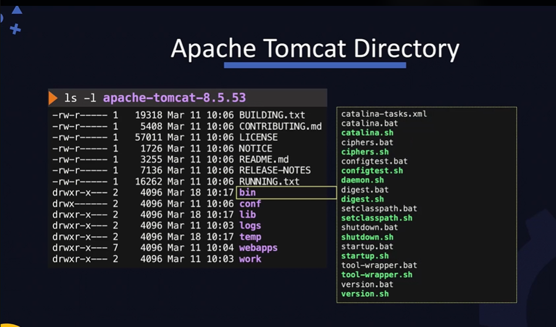
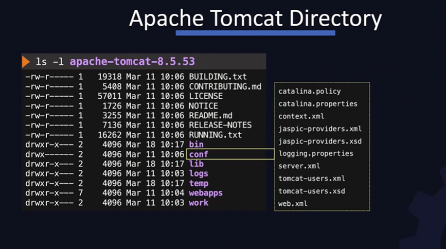
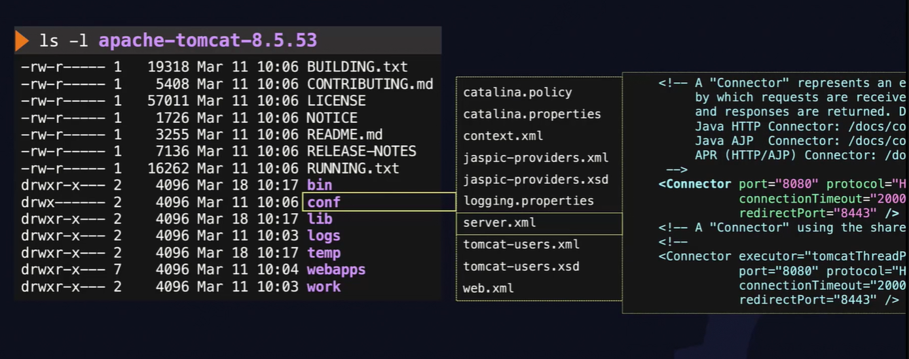
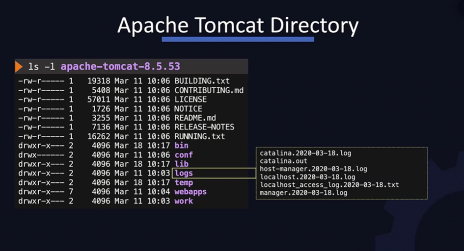
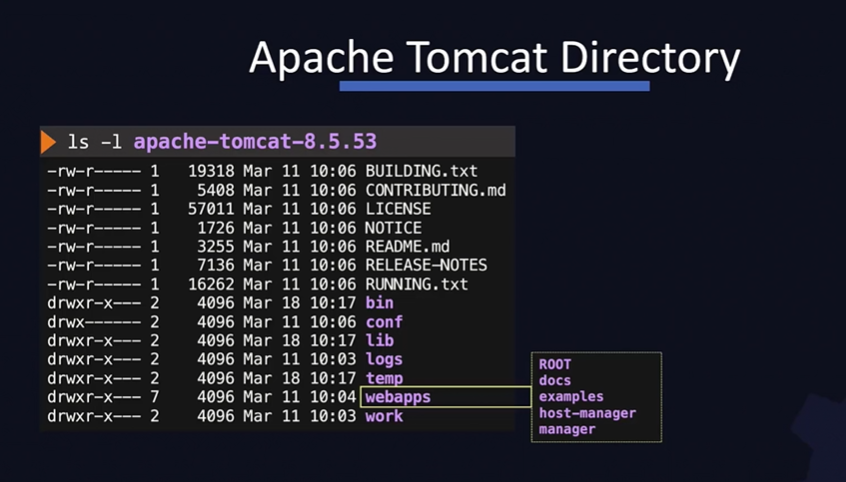
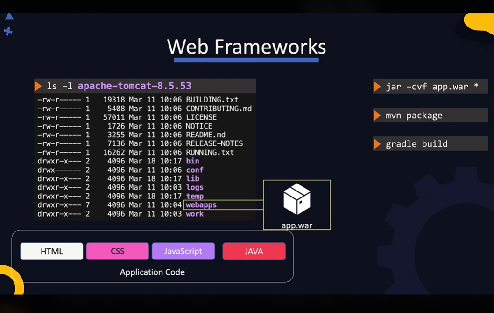
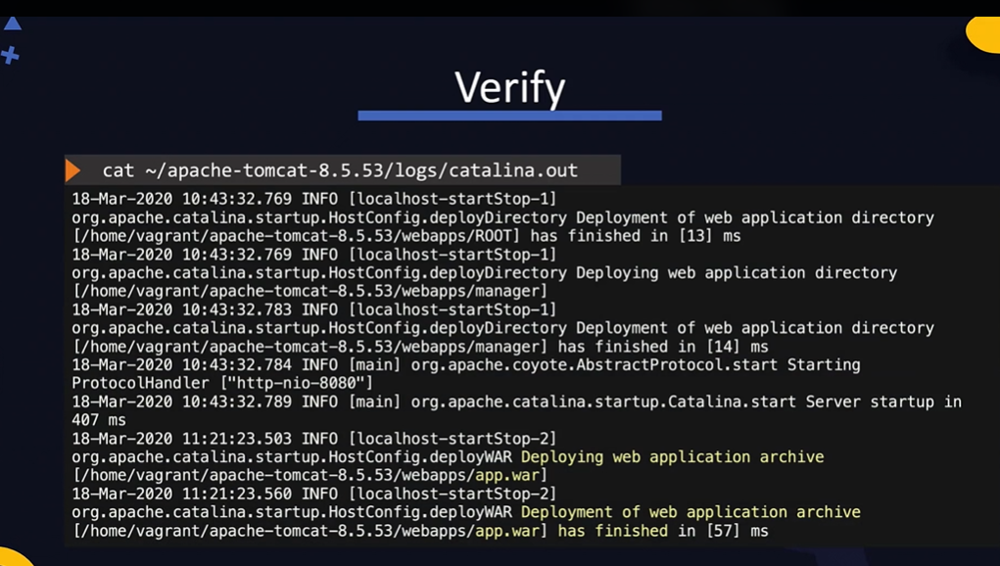
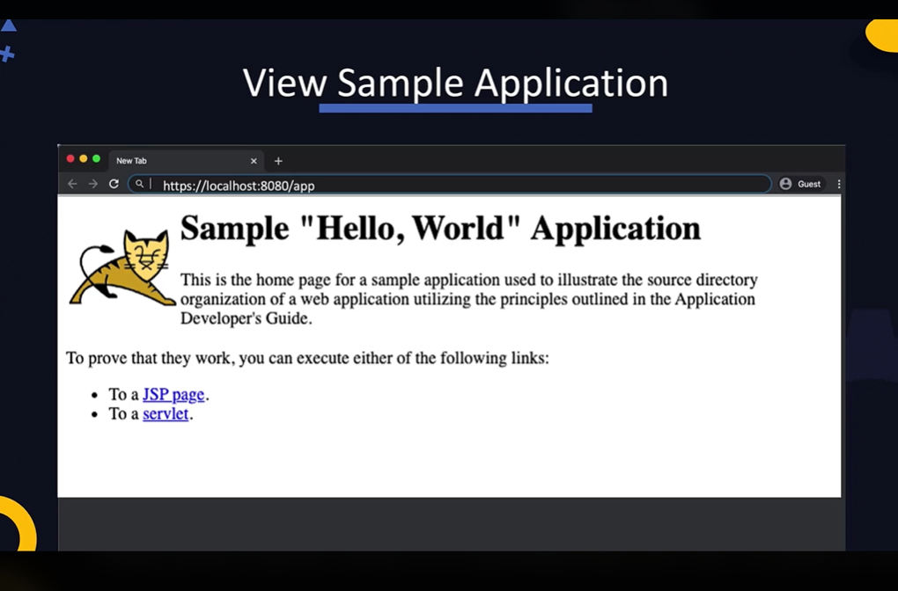

The apache tom cat server provides a web server environment where we can host java based we applications.

As a perequisite we need to have java installed before we download Apache tom cat.

We can downlaod the apache tomcat from the downloads oage and then extract the downloaded package:
```bash
#download
wget https://downloads.apache.org/tomcat/tomcat-8/v8.5.53/bin/apache-tomcat-8.5.53.tar.gz

#extract
tar xvf apache-tomcat-8.5.53.tar.gz

#start
./apache-tomcat-8.5.53/bin/start.sh
```

This is a simplified process, there are other production level best practices you must check for and adhere to.

One started, check that the site is working by visiting port 8080. You should see the default page.

### The Extracted Apache TomCat Directory


#### The bin directory 
has a list of scripts and .bat files. The .bat files are used if you are running on windows and .sh scripts are used for Linux environments

Of these, the startup.sh and the shutdown.sh are used to start and stop the Tomcat server. Notice we used it some line up


#### The conf directory
Under the conf directory, we have multiple configuration files where we configure the wen server. This is where we configure what the port should listen to and how to direct traffic between the different web apps etc. 

The server.xml file has na entry fo rthe connector. The connector is an endpoint at which the requests are received. It is set to 8080and that is the default port that TomCat listens on. We can change the port number here if required. Of course any change to this file will reuqire a restrat of the tomcat service.
similarly the web.xml is used to deploy and configure web applications:


#### The logs directory
The logs directory is where the logs are stored. This is a good place to look at when you run into issues


#### The web apps directory 
is where web applications hosted by TomCat Server are located and that is where you should place your application that you want Apache to serve:


After all this, we package the application. Becuase this application file also has HTML, CSS and JS files togther with the Java files we will package it as a WAR (web archive) file instead of a JAR file:
`jar -cvf app.war`

Another approach which is recommended is to use a built tool like Maven or Gradle to build and package the application.
One the application is packaged, move the WAR file to the webapps directory of the server:


If the tomcat server is already running it will automatically detect that an application has been placed in the web apps directory and the server will automatically extracts the WAR file into a directory with the same name as the WAR file. Once done, the application is then accessible via a URL path that matches the directory name. 

We can verify that the new applicationis hosted by viewin gthe logs if the TomCar Server under the logs directory:


We can also see view the web application by visiting the URL of the Tomcat server at port 8080 and appedninging the name of the application into the URL:


In this case because the WAR file is named app, the path to the application is /app.